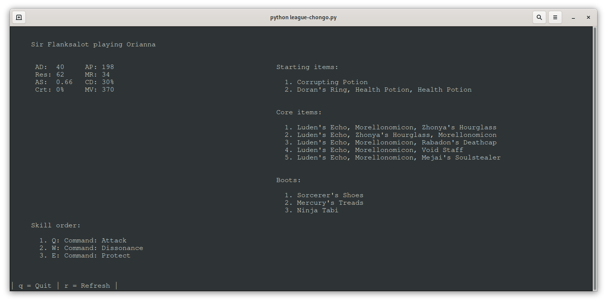

# Simple League Helper 🔧🚀

This simple script detects when you start a [League of Legends](https://leagueoflegends.com/) game and shows you some useful information about your current game.

## Information

It shows you common starting items and builds for the champion you are playing. It also displays the skill order for your current champion.
The information is scraped from [op.gg](https://op.gg/).

It also displays your current in-gmae champion stats, including:
* Attack Damage
* Ability Power
* Armor
* Magic Resist
* Attack Speed
* Cooldown Reduction
* Critical HiT Chance
* Movement Speed

## Motivation

The main purpose for the project for me was to get to know the League of Legends client API. I don't intend to add anything major moving forward.

